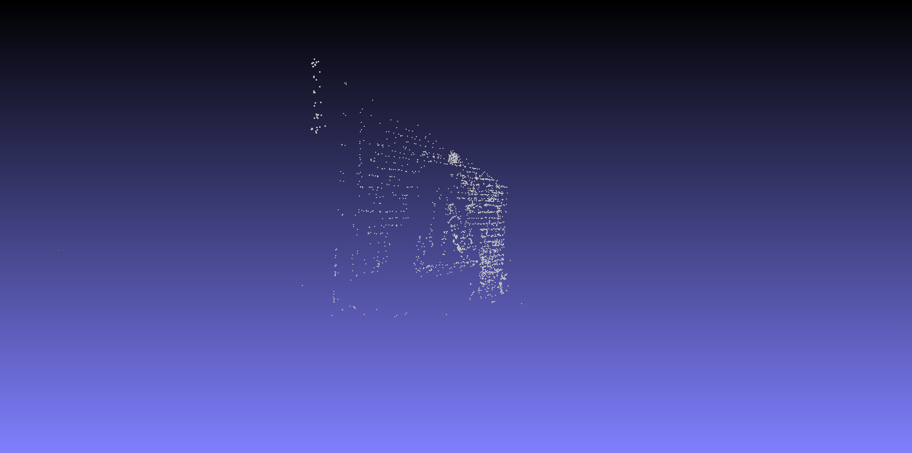
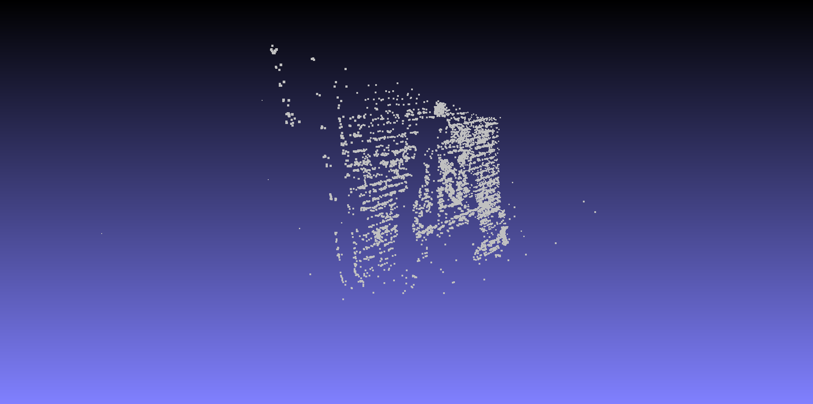

# 3D Reconstruction using Structure from Motion

This repository contains code to reconstruct a scene using [structure from motion](https://en.wikipedia.org/wiki/Structure_from_Motion) (SfM). SfM is a technique to recover 3D structure of a scene by making use of a sequence of 2D images. In the process, the technique also recovers the relative pose of a particular view (an image taken by a camera) with respect to the first view in the sequence. This is a **personal project**.

The process consists of a series of steps:

1. Extract keypoints and feature descriptors from images
2. Match features between images
3. Find a suitable baseline (initial two views) to kickstart the reconstruction
4. Recover pose of the baseline
5. Reconstruct 3D points
6. Recover pose of the next view using [Perspective-n-Point](https://en.wikipedia.org/wiki/Perspective-n-Point)
7. Reconstruct the next set of points
8. Perform [bundle adjustment](https://en.wikipedia.org/wiki/Bundle_adjustment)
9. Plot points

### Requirements

- Python 3
- Numpy
- Opencv-contrib-python == 3.4.2
- Open3D == 0.8.0.0

### Images

The code has been run on openMVG's [benchmark images](https://github.com/openMVG/SfM_quality_evaluation). The images come with the intrinsic matrix of the camera as a txt file in the images folder. This code has not been tested on images taken on my camera. Users choosing to do so need to calibrate their camera to obtain the intrinsic matrix required for this code. Follow [this](https://opencv-python-tutroals.readthedocs.io/en/latest/py_tutorials/py_calib3d/py_calibration/py_calibration.html) tutorial to calibrate your camera.

### Running the code

The entry point of the module is the ```main.py``` file. This file requires three arguments -

- ```--root_dir``` : specifies the path of the folder containing the image folder
- ```--feat_type``` : specifies the kind of features to be extracted from the images (sift/surf/orb), default is sift
- ```--image_format``` : specifies the extension of the images present inside the ```images/``` folder of the ```root_dir```, default is jpg

For example, if you have downloaded the [benchmark images](https://github.com/openMVG/SfM_quality_evaluation) inside the repository root, then the command would be -

```python main.py --root_dir ./SfM_quality_evaluation/Benchmarking_Camera_Calibration_2008/entry-P10 --feat_type surf```

Or:

```python main.py --root_dir ./SfM_quality_evaluation/Benchmarking_Camera_Calibration_2008/fountain-P11 --feat_type sift```

Each of the above mentioned folders have an ```images/``` folder that contains the images, along with a txt file called ```K.txt``` which contains the intrinsic matrix. If you are experimenting on a new dataset, use the same folder structure. The code stores the computed features and matches in respective pkl files inside the root directory to speed up repeated computations. The results are stored as ply files inside a ```points/``` folder inside the root directory. For visualizing the point clouds inside the ply files, use suitable software such as [MeshLab](https://www.meshlab.net/#description).

### Results

From the ```fountain-P11``` image-set:

1. Original image


2. Reconstruction after 3 images



3, Reconstruction after 6 images



### Limitations

- This code is a simplified version of incremental SfM. Incremental SfM adds images sequentially to the reconstruction wheras global SfM considers all camera poses at once. In incremental SfM, the next view is chosen for reconstruction based on how many triangulated points it contains. The process examines the available views to choose the best one. In this code, the images are assumed to be taken in sequential order. For example, ```0003.jpg``` is taken before ```0004.jpg```, and the baseline views are ```0000.jpg``` and ```0001.jpg```. The images are sorted based on their names before reconstruction. View selection and filtering is currently not implemented here
- Bundle adjustment is not implemented here, so some reconstructions may have high reprojection error and consequentially, erroneous reconstructions

### References

1. [Hartley and Zisserman's Multiple View Geometry](https://www.amazon.com/Multiple-View-Geometry-Computer-Vision/dp/0521540518)
2. [Mastering OpenCV with Practical Computer Vision Projects](https://www.packtpub.com/application-development/mastering-opencv-practical-computer-vision-projects)
3. [Colmap](https://github.com/colmap/colmap)
4. [OpenSfM](https://www.opensfm.org/)
3. [how-to-sfm](https://github.com/muneebaadil/how-to-sfm)
